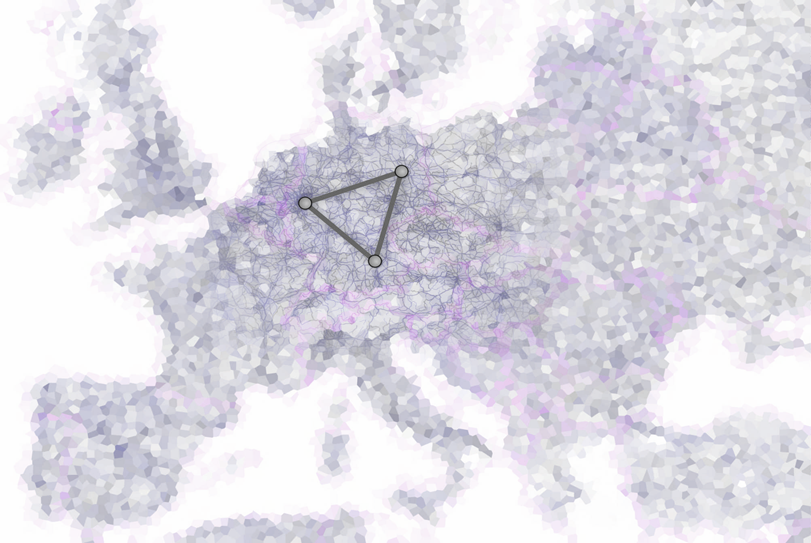

# MoIn - Machbarkeitsstudie zur Erstellung eines bundesweiten Mobilitätsindex

Obgleich Erreichbarkeit zu den wichtigsten Standortfaktoren für Bürger*innen und Unternehmen gehört, gibt es in Deutschland keine Quelle, die sie umfassend und flächendeckend bewertet. Sie setzt sich aus vielen Qualitätsmerkmalen (Zeit, Frequenz, Kosten etc.) über diverse Verkehrsmittel und Modalketten hinweg zusammen. Das Ziel von MoIn war die konzeptuelle Entwicklung eines bundesweiten Mobilitätsindexes und eine Aussage über dessen technische und ökonomische Umsetzbarkeit. Für die Berechnung und Modellierung wurden Quelldaten zu einem Wissengraphen konvertiert, semantifiziert, integriert sowie die Berechnung des Indexes für verschiedene Verkehrsträger und einer Auswahl an Kommunen durchgeführt. 

# Ergebnisse und Wirkung

Im Rahmen dieser Machbarkeitsstudie sind Ansätze zur Berechnung, Abfrage, Bedienbarkeit und Visualisierung erfolgreich untersucht worden. Im Ergebnis ist folgendes zu benennen:
- Es wurden die 100 größten deutschen Kommunen und deren vom Verkehrsträger abhängige Verbindungen untereinander zu einem Wissensgraphen konvertiert und analysiert (ca. 220K Informationen unmittelbar, 2M Informationen mittelbar).
- Auf Basis der Datenauswahl wurde die technische Realisierbarkeit des Indexes für alle Kommunen Deutschlands abgeleitet. Konzepte zum Umgang mit heterogener Datenqualität resp. regionalen Gegebenheiten wurden hierbei mitbetrachtet (z.B. Kommunen ohne Bahnhof oder Flughafen).
- Infrastrukturveränderungen führen zu Änderungen an Daten. Konzepte zur Verarbeitung der Datenänderungen wurden mit bedacht.  
- Ein Web-Demonstrator wurde geschaffen und diverse Visualisierungen wurden erprobt. 
- Eine prototypisch geschaffene API und die Integrationsfähigkeit der Daten in potentielle Anwendungen wurde untersucht.
- Interessengruppen wurden befragt und der Markt wurde analysiert.

# Verbundkoordinator

<figure style="float:right">
  
  <figcaption>Symbolbild: Verkehrswege in Europa</figcaption>
</figure>

[Institut für Angewandte Informatik (InfAI) e.V.](https://www.infai.org)  
An-Institut an der Universität Leipzig  
Goerdelerring 9 | 04109 Leipzig  

# Projektlaufzeit
12/2020 – 11/2021

# Projektpartner
[CISS TDI GmbH](https://www.ciss.de/)  
[LocosLab GmbH](https://www.locoslab.com)  
[YellowMap AG](https://www.yellowmap.com/)  
[Universität Duisburg-Essen](https://www.nes.uni-due.de)  

# Ansprechpartner
Institut für ANgewandte Informatik e.V.  
Dr. Michael Martin  
Tel.: 0341  229037 – 51  
E-Mail: martin@infai.org  

